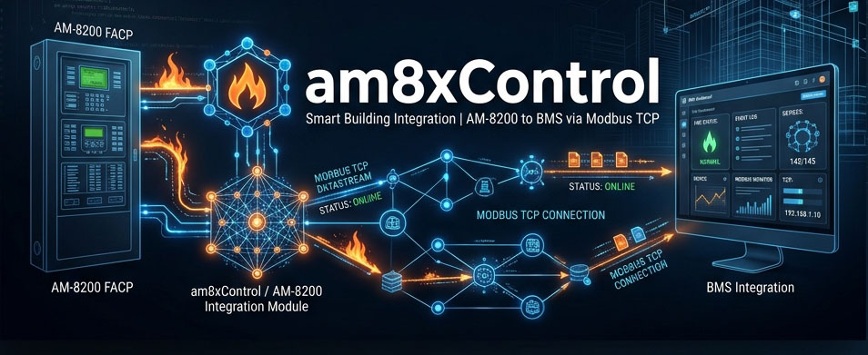

<h1 align="center">
  
  <br>
  am8xControl
  <br>
</h1>

<h4 align="center">Modulo Niagara 4.15 per l'importazione automatica di centrali antincendio Hochiki/Notifier AM-8200N.</h4>

<p align="center">
  
  
  
  
  <a href="https://www.buymeacoffee.com/gturturro"></a>
</p>

<p align="center">
  <a href="#-scopo">Scopo</a> •
  <a href="#-installazione">Installazione</a> •
  <a href="#-utilizzo">Utilizzo</a> •
  <a href="#-architettura-e-dettagli-tecnici">Dettagli Tecnici</a>
</p>

<p align="center">
  
</p>

---

## 🎯 Scopo

`am8xControl` è un modulo progettato per ridurre drasticamente i tempi di commissioning su Niagara 4.
Importa la topologia di una o più centrali antincendio **AM-8200N** direttamente dal file XML generato dal tool di configurazione.

Consente all'operatore di rivedere e modificare *offline* i dispositivi scoperti tramite un pannello visivo, generando poi automaticamente l'intero albero **Modbus TCP** (con proxy extension e link pre-configurati) sotto `/Drivers/ModbusTcpNetwork` nella Station.

---

## 🚀 Installazione

Se stai utilizzando una release ufficiale `.zip` con i moduli già compilati e firmati, l'installazione richiede pochi passaggi:

1. Importa il certificato (es. `code.pem`) nel **User Trust Store** in Niagara Workbench.
2. Copia i file `.jar` all'interno della cartella `modules/` della tua installazione Niagara.
3. Riavvia la Station e il Workbench.

👉 **Leggi la [Guida all'Installazione Completa](docs/installazione.md)** per le istruzioni dettagliate passo-passo.

---

## 💻 Utilizzo

1. **Aggiungi il Servizio:** Dalla palette `am8xControl`, trascina `Am8xImportService` nella cartella `/Services` della tua Station.
2. **Apri il Manager:** Fai doppio clic sul servizio per aprire la vista di importazione.
3. **Discover:** Clicca sul pulsante **Discover** nella barra in basso, carica il file XML della centrale e imposta IP e Porta Modbus.
4. **Revisione:** Controlla l'albero dei dispositivi trovati. Puoi rinominarli, spostarli di zona o deselezionare quelli non necessari.
5. **Commit:** Clicca su **Commit**. Il modulo genererà automaticamente l'intera rete Modbus TCP con tutti i point, il device della CENTRALE (per i comandi generali) e i folder organizzati per Loop.

---

## 🛠 Architettura e Dettagli Tecnici

Per facilitare la lettura, i dettagli tecnici approfonditi per sviluppatori sono stati organizzati in sezioni espandibili.

<details>
<summary><b>📂 Struttura del Modulo</b></summary>

```text
am8xControl/
├── am8xControl-rt/          ← codice che gira nella station (runtime)
│   └── src/.../
│       ├── service/           BAm8xImportService, BAm8xWizardInput
│       ├── discovery/         BAm8xDiscoveryReport, BAm8xPanelFolder, BAm8xDiscoveryCandidate
│       ├── parser/            Am8xXmlParser, Am8xDeviceDescriptor, Am8xSubModuleDescriptor
│       ├── modbus/            ModbusTreeBuilder, ModbusPointFactory, Am8xModbusAddressing, BAm8xStatePoint
│       └── model/             CandidateKey
└── am8xControl-wb/          ← codice che gira nel Workbench (UI)
    └── src/.../wb/
        ├── BAm8xImportManager
        ├── Am8xImportController
        ├── Am8xImportLearn
        └── Am8xImportModel
```

</details>

<details>
<summary><b>🔄 Flusso Utente Interno (Workflow RPC)</b></summary>

```text
[WB] Apri BAm8xImportService
        ↓ BAm8xImportManager si monta automaticamente in learn mode
[WB] Pulsante "Discover"
        ↓ Popup: File XML (PC… | Station…), IP Modbus, Porta, Device Address Start
        ↓ service.discover() invocato via RPC
[Station] BAm8xImportService.doDiscover()
        ↓ Legge XML → Am8xXmlParser → lista Am8xDeviceDescriptor
        ↓ Popola discovery/ con BAm8xPanelFolder → BAm8xDiscoveryCandidate
[WB] Am8xImportLearn mostra albero: centrale (folder) → device (leaf)
        ↓ Utente seleziona device → "Edit Device" per modificare Label/Zone/Indirizzi
        ↓ Utente usa "Cancel" per deselezionare tutta una centrale
[WB] Pulsante "Commit"
        ↓ Conferma se ci sono già-importati
        ↓ service.commit() → doAddSelected()
[Station] doAddSelected()
        ↓ Crea/aggiorna BModbusTcpNetwork + BModbusTcpDevice per ogni centrale
        ↓ Crea device CENTRALE con punti di controllo generali (Buzzer, Alarm, Zone…)
        ↓ Per ogni candidate selected → crea BAm8xStatePoint + BNumericPoint + Link
```

</details>

<details>
<summary><b>⚙️ Logica Modbus e Point Factory</b></summary>

### Indirizzamento Modbus (`Am8xModbusAddressing`)
Due registri per ogni device:
* **Sensore:** Stato = `loop×5000 + 2000 + pos` | Analogico = `stato + 1000`
* **Modulo M720:** Stato = `loop×5000 + modulePos×10 + channel` | Analogico = `stato + 1000`

### Creazione Albero Modbus (`ModbusTreeBuilder`)
Il costruttore trova (o crea, garantendo l'idempotenza) la gerarchia:
`Drivers/ModbusTcpNetwork/{Centrale_Name}/points/L{loop}/{device}`.

### Custom Enum Point (`BAm8xStatePoint`)
Un point speciale che estende `BEnumPoint` con un enum personalizzato (Normale, Guasto, Allarme, ecc.) e possiede property meta-dati come `valoreCamera`, linkati dinamicamente al corrispettivo Point analogico, oltre che Action dedicate per Esclusione/Inclusione dei sensori, gestite creando point preset *on-the-fly*.
</details>

<details>
<summary><b>📦 Dipendenze e Limitazioni Note</b></summary>

### Dipendenze modulo
* **Niagara 4.15** — `baja`, `bajaui`, `workbench`, `workbench-mgr`
* **modbusTcp** — `BModbusTcpNetwork`, `BModbusTcpDevice`
* **modbusCore** — `BModbusClientNumericProxyExt`, `BModbusClientEnumBitsProxyExt`, `BModbusClientPresetRegisters`, `BFlexAddress`, `BModbusClientPointFolder`

### Limitazioni Note Attuali
1. **Upload non testato in produzione** — il meccanismo RPC Base64 per il caricamento da PC è stato implementato ma non ancora validato end-to-end sul campo.
2. **`clearImported` non implementato** — l'azione di rimozione automatica dal DB Niagara dei point importati è un placeholder per sviluppi futuri.
3. **`alreadyImported` non sincronizzato** — il flag viene impostato, ma non ancora ri-sincronizzato con l'albero Modbus reale a ogni apertura del Manager.

</details>

---

<p align="center">
  Realizzato con ❤️ per <b>Niagara 4.15</b>.
</p>
