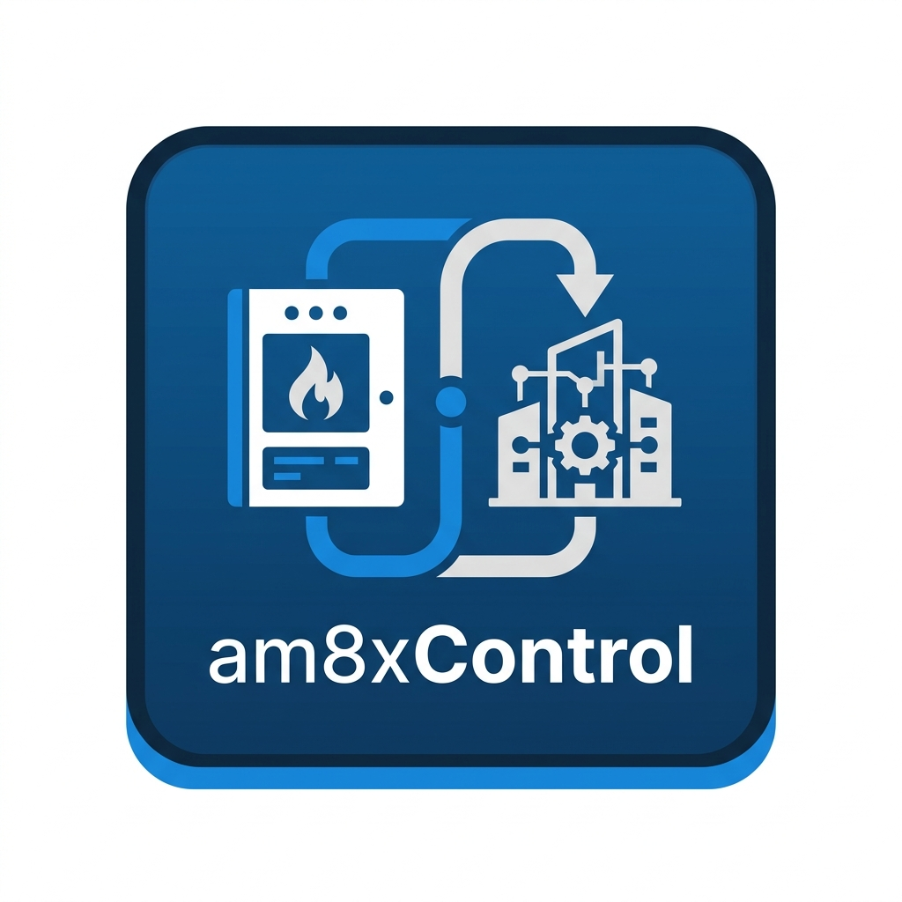
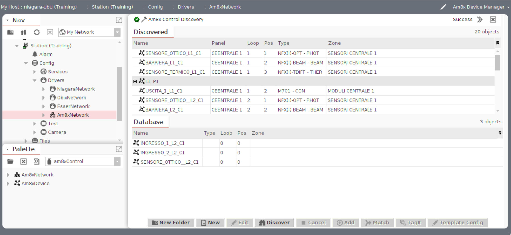

<div align="center">
  

  # am8xControl - Niagara Framework Module

  
  
  
  
</div>

**am8xControl** è un modulo custom per Niagara Framework 4.15 che importa la topologia di una centrale antincendio **Notifier Serie AM-8x00** a partire dal file XML esportato dal tool di configurazione del pannello.



---

## Funzionalità (v3)

- **Discovery View nativa NDriver** — la topologia appare nel pannello Discovery del Device Manager esattamente come per qualsiasi altro driver Niagara standard.
- **Colonne disco**: Panel, Loop, Pos, Type, Zone — visibili direttamente nel pannello Discovery senza configurazione aggiuntiva.
- **M720 come gruppo espandibile** — i dispositivi M720 (contenitori di sub-moduli) appaiono come nodi espandibili; i loro sub-moduli (MON3, IN3, ecc.) possono essere aggiunti singolarmente.
- **Nomi slot sanitizzati** — le etichette dal file XML vengono convertite automaticamente in nomi slot Niagara validi (spazi e caratteri speciali → underscore).
- **Import selettivo** — si può aggiungere singolarmente ogni device o sub-modulo; il pulsante Add è disabilitato sui nodi gruppo (M720).
- **Pulsante Match** — selezionando un device già presente nel database appare il pulsante Match al posto di Add; il matching è ricorsivo (trova device anche dentro `BNDeviceFolder`).
- **Points Modbus automatici** — all'avvio ogni `BAm8xDevice` crea automaticamente 3 point figli (`alarm`, `fault`, `statusLabel`) con indirizzi Modbus pre-calcolati basati su loop e posizione.
- **Indirizzi Modbus deterministici** — le formule seguono la specifica ufficiale AM-8x00: `sensor = loop×5000 + 2000 + pos`, `module = loop×5000 + modulePos×10 + channel`.
- **Offline Importer** — predispone la struttura Niagara prima ancora del collegamento fisico alla centrale, risparmiando ore in fase di commissioning.

Per avviare la discovery configurare la proprietà `xmlFilePath` su `BAm8xNetwork` e cliccare **Discover** nel Device Manager. Se il campo è lasciato vuoto, il modulo usa il file XML di test incluso come risorsa.

---

## Changelog

### v3.0 — Points Modbus automatici + Match button

**Nuove funzionalità:**

- **`Am8xModbusAddressing`** — classe utility con formule Modbus deterministiche per sensori e sub-moduli M720. Non sono magic number: le formule sono derivate dalla specifica del pannello AM-8x00.
- **`BAm8xDevice.ensurePoints()`** — chiamato da `started()`, crea automaticamente 3 point figli se non già presenti:
  - `alarm` — `BBooleanPoint` con `BModbusClientBooleanProxyExt`, indirizzo calcolato
  - `fault` — `BBooleanPoint` con `BModbusClientBooleanProxyExt`, indirizzo calcolato
  - `statusLabel` — `BStringPoint` per etichetta stato testuale
- **Logica di indirizzo**: sensori diretti usano `loop×5000+2000+pos`; sub-moduli M720 usano `loop×5000+modulePos×10+channel`; il campo `parentModulePos` su `BAm8xDevice` discrimina i due casi.
- **`BAm8xNetwork.modbusNetworkOrd`** — property opzionale che punta alla `BModbusTcpNetwork` che gestisce il polling fisico della centrale.
- **`Am8xDeviceLearn.isMatchable()`** — override del hook framework: abilita il pulsante **Match** per device già presenti nel DB senza riabilitare Add (che rischierebbe duplicati).
- **Matching ricorsivo** — `matchesInTree()` trova device anche all'interno di `BNDeviceFolder`, necessario se i device vengono organizzati in cartelle.

---

### v2.0 — NDriver Discovery View nativa

Riscrittura completa del layer di presentazione. L'architettura segue ora il pattern NDriver ufficiale documentato in *NDriver Manager's Guide*.

**Cambiamenti principali rispetto a v1:**

| Aspetto | v1 | v2 |
|---|---|---|
| Pattern discovery | `BJobService` custom + action `discover` | `BNDiscoveryJob.submit(null)` — infrastruttura NDriver nativa |
| Presentazione risultati | Pannello generico / log | **Discovery View** con colonne Panel / Loop / Pos / Type / Zone |
| Tipi Baja | `BAm8xDiscoveryEntry` senza `@NiagaraType` | `@NiagaraType @NoSlotomatic` + Baja properties con `SfUtil.incl()` per le colonne |
| Proxy serialization | Non funzionante attraverso il proxy | `BAm8xDiscoveryEntry` è un tipo Niagara registrato, si serializza correttamente RT→WB |
| Nomi slot | Potenziali nomi illegali con spazi | `getDiscoveryName()` sanitizza con `replaceAll("[^a-zA-Z0-9_]", "_")` |
| M720 sub-moduli | Flat list | Nodi gruppo espandibili; sub-moduli come figli separati |
| WB layer | `BAm8xNetworkManager` monolitico | `BAm8xDeviceManager` + `Am8xDeviceLearn` + `Am8xDeviceController` + `Am8xDeviceModel` |

**Nuove classi:**

| Classe | Modulo | Ruolo |
|---|---|---|
| `BAm8xDiscoveryEntry` | rt | Entry della Discovery View: `@NiagaraType`, Baja properties, `SfUtil.incl()` |
| `BAm8xDiscoveryPreferences` | rt | Dichiara `getDiscoveryLeafType()` — richiesto dal framework NDriver |
| `BAm8xLearnDevicesJob` | rt | Job di discovery tipizzato (`extends BNDiscoveryJob`) |
| `Am8xSubModuleDescriptor` | rt | Value object per i sub-moduli `<SubModule><Module>` nell'XML |
| `BAm8xDeviceManager` | wb | Device Manager NDriver — factory per Learn/Model/Controller |
| `Am8xDeviceLearn` | wb | Colonne discovery, gestione gruppi M720, fix Name column |
| `Am8xDeviceController` | wb | Controller NDriver (delegate default) |
| `Am8xDeviceModel` | wb | Model NDriver (delegate default) |
| `Am8xModbusAddressing` | rt | Formule indirizzi Modbus per sensori e sub-moduli M720 |

**Classi modificate:**

- `BAm8xNetwork` — rimosso il vecchio job BJobService; aggiunto `submitDiscoveryJob()` e `getDiscoveryObjects()` pattern NDriver; rimossa proprietà `lastDiscoveryData`
- `BAm8xDevice` — estende ora `BNDevice`; aggiunto `applyDescriptor()`
- `Am8xDeviceDescriptor` — aggiunto supporto sub-moduli (`addSubModule`, `getSubModules`, `hasSubModules`)
- `Am8xXmlParser` — aggiunto parsing `<SubModule><Module>` per dispositivi M720

**Classi rimosse:**

- `BAm8xNetworkManager` (wb) — sostituito da `BAm8xDeviceManager`

---

## Struttura del Modulo

```
am8xControl/
├── am8xControl-rt/          # Runtime: logica di parsing, tipi Niagara
│   └── src/com/sitecVendor/am8xControl/
│       ├── BAm8xNetwork.java            # BNNetwork + BINDiscoveryHost + modbusNetworkOrd
│       ├── BAm8xDevice.java             # BNDevice — device importato + ensurePoints()
│       ├── BAm8xDeviceFolder.java       # Cartella per raggruppamento per centrale
│       ├── BAm8xDiscoveryEntry.java     # Entry @NiagaraType per Discovery View
│       ├── BAm8xDiscoveryPreferences.java  # Preferenze discovery NDriver
│       ├── BAm8xLearnDevicesJob.java    # Job discovery tipizzato
│       ├── Am8xDeviceDescriptor.java    # Value object device (con sub-moduli)
│       ├── Am8xSubModuleDescriptor.java # Value object sub-modulo M720
│       ├── Am8xModbusAddressing.java    # Formule indirizzi Modbus (sensori + moduli)
│       └── Am8xXmlParser.java           # Parser XML topologia AM-8200N
└── am8xControl-wb/          # Workbench: Device Manager e Discovery UI
    └── src/com/sitecVendor/am8xControl/wb/
        ├── BAm8xDeviceManager.java      # Device Manager NDriver
        ├── Am8xDeviceLearn.java         # Colonne discovery + Match + gestione gruppi
        ├── Am8xDeviceController.java    # Controller device
        └── Am8xDeviceModel.java         # Model device
```

---

## Build

```bash
./gradlew clean build
```

Deploy manuale dei jar in `/opt/Niagara/<versione>/modules/` + restart del daemon.

---

## Per gli Sviluppatori (Community Niagara)

Questo progetto è condiviso con la community Niagara come riferimento per implementare un driver con **Discovery View nativa NDriver**. È un punto di partenza solido per chiunque voglia:

- imparare il pattern `BINDiscoveryHost` / `BNDiscoveryJob` / `BNDiscoveryLeaf`
- capire come esporre colonne personalizzate nel pannello Discovery
- gestire gerarchie di discovery (nodi gruppo + figli) con `NMgrLearn`

### Come contribuire

1. Fork del repository
2. Crea un branch: `git checkout -b feature/nome-feature`
3. Compila: `./gradlew clean jar --parallel`
4. Commit + Push
5. Apri una Pull Request descrivendo le modifiche

---

## Roadmap

- ~~**Fase 3** — Points Modbus automatici sotto ogni device~~  ✅ completata in v3.0
- **Fase 4** — Polling live: collegamento di `BAm8xNetwork` a una `BModbusTcpNetwork` per aggiornamento automatico dei valori `alarm` / `fault` in run-time.
